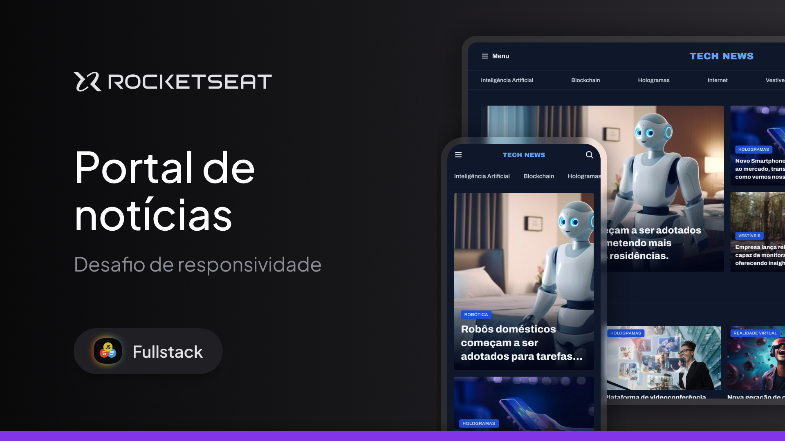

<div align="center">

# 📰 Portal de Notícias

<p align="center">


</p>

Uma homepage de portal de notícias sobre tecnologia desenvolvida durante a formação **Fullstack da Rocketseat**.



</div>

---

## 📖 Sobre o projeto

Este projeto consiste na criação de uma **homepage de um portal de notícias sobre tecnologia**, desenvolvida como parte dos projetos da formação **Fullstack da Rocketseat**.

A proposta foi construir uma interface de notícias utilizando **HTML5 e CSS3**, explorando diferentes técnicas de estruturação e estilização para criar um layout organizado e visualmente próximo de um portal de tecnologia real.

O projeto também foi utilizado como prática para revisar e aprofundar conceitos fundamentais de **HTML e CSS**, principalmente relacionados à construção de layouts utilizando CSS Grid e à organização dos estilos em diferentes arquivos.

> 🚧 **Observação:** Esta versão do projeto ainda não possui responsividade. A responsividade faz parte do desafio proposto pela formação e será uma possível evolução futura do projeto.

---

## 🚀 Demonstração

🔗 **Deploy:**  
https://vbuarque.github.io/RS-Portal-de-noticias-HTML/

---

## 💻 Tecnologias utilizadas

- HTML5
- CSS3
- Google Fonts

---

## 📚 Conceitos praticados

Durante o desenvolvimento foram praticados e revisados diversos conceitos de **HTML5 e CSS3**, entre eles:

### HTML

- Estrutura semântica com `header`, `nav`, `main`, `section`, `article` e `aside`
- Utilização de `figure` e `figcaption` para conteúdos de notícias
- Hierarquia de títulos
- Links e navegação
- Atributos `alt` para imagens
- Organização semântica do conteúdo

### CSS

- CSS Grid
- `grid-template-columns`
- `grid-template-areas`
- `grid-auto-flow`
- Gap entre elementos
- CSS Variables
- Organização de tipografia
- Google Fonts
- Pseudo-classes como `:hover` e `:has()`
- Pseudo-elementos como `::before`
- Gradientes
- `object-fit`
- `aspect-ratio`
- Bordas e bordas arredondadas
- Espaçamentos com `margin` e `padding`
- Organização de cores e estilos reutilizáveis

### Organização do CSS

O projeto também utiliza uma estrutura de arquivos CSS separada por responsabilidade:

- `global.css` — estilos globais, variáveis, tipografia e estrutura geral
- `header.css` — estilos relacionados ao cabeçalho e navegação
- `sections.css` — estilos específicos das seções do portal
- `utility.css` — classes utilitárias para grid, espaçamentos e tipografia
- `index.css` — arquivo responsável por importar os demais estilos

Essa organização ajudou a manter o código mais modular e facilitou a manutenção dos estilos.

---

## 📰 Estrutura do portal

A página foi dividida em diferentes seções de conteúdo:

### Destaques

Área principal com as notícias em destaque, utilizando diferentes tamanhos de cards e sobreposição de texto sobre as imagens.

### Mais lidas da semana

Seção contendo as notícias mais populares da semana organizadas em cards.

### Destaques da Inteligência Artificial

Lista de notícias relacionadas à Inteligência Artificial, utilizando uma estrutura com texto e imagem lado a lado.

### Viu isso aqui?

Área lateral contendo conteúdos adicionais e recomendações de outras notícias.

---

## 📂 Estrutura do projeto

```text
📦 RS-Portal-de-noticias-HTML
├── assets/
│   ├── icons/
│   ├── images/
│   ├── Ads.png
│   ├── Logo.svg
│   └── Thumbnail.png
│
├── styles/
│   ├── global.css
│   ├── header.css
│   ├── index.css
│   ├── sections.css
│   └── utility.css
│
├── index.html
└── README.md
```
